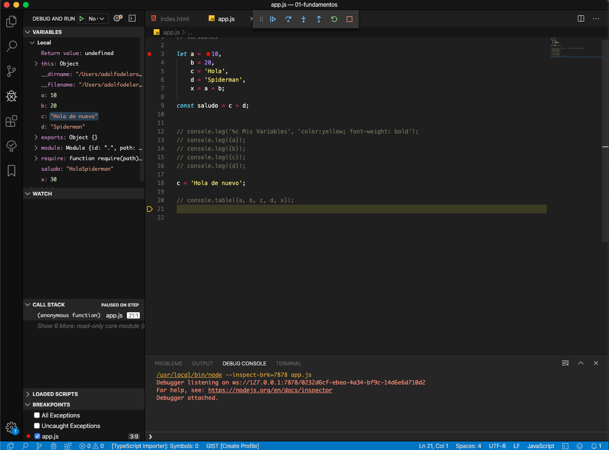

# 2. Introducción a JavaScript y a la Consola 01:27:02

## Introducción a la sección 02:28

:+1:

## Temas puntuales de la sección 00:17

#### Temas de la sección

En esta sección tocaremos los siguientes temas:

* Historia de JavaScript

* Uso de JavaScript en la industria actual

* Hola Mundo en JavaScript

* Creación de variables y constantes

* Introducción a la consola de JavaScript

* Depuración y breakpoints

* Problemas con la declaración de variables con var

* Prompts, alerts, confirms.

Recuerden que al final de la sección tendrán el código fuente para que lo descarguen en caso de que sea necesario para compararlo o bien para tenerlo como respaldo.

## JavaScript y su historia 04:44

JS es un lenguaje interpretado.

Creador: Brendan Eich, empleado de NetScape => LiveScript => JavaScript

Microsoft => JScript

En 1997 Se crea la especificación JS [ECMA](https://www.ecma-international.org/) (European Computer Manufacturers Association)

Comite creado ECMA TC39

* Primer Standar ECMA-262

## Usos de JavaScript 04:17

Con JS podemos crear muchos tipos de aplicaciones:

* [Google Maps](https://www.google.es/maps/@40.3813641,-3.7333547,4z)

* [Presentaciones con REVAL.JS](https://revealjs.com/#/)

* [Servidores Web con Node](https://nodejs.org/es/)

   * Manejar peticiones
   * Crear archivos en el sistema del servidor 
   * Conectarnos a BD
   * Recuperar información 
   * Generar información de respuesta a las peticiones 
   * Comunicación en tiempo real con sockets.
   
* Crear Video Juegos [On the Run](http://js13kgames.com/games/underrun/index.html)

* Aplicaciones Móviles 
   
   * Ionic
   * React Native
   * NativeScript
   * Electron (Aplicaciones Nativas)
   
* Aplicaciones Web

   * Angular
   * React
   * Vue
      
## Hola Mundo 13:52

### 1. Hola Mundo Desde el Navegador

Cada navegador tiene su propia implementación del ECMAScript por lo que cada uno tiene su propia versión de JS.

Vamos a abrir Google Chrome y con F12 las Herramientas de Desarrollador en la pestaña Consola.

Escribimos lo siguiente:

```js
> console.log('Hola Mundo');
  Hola Mundo
  undefined

> document.write('Hola Mundo');
undefined
```

Las anteriores son dos formas diferentes de hacer nuestro "Hola Mundo", la primera saca el mensaje en la Consola y la segunda en el HTML.


### 2. Hola Mundo Desde Consola Node

Usando Node como interprete de JS.

```js
192:~ adolfodelarosa$ node --version
v12.14.0

192:~ adolfodelarosa$ node
Welcome to Node.js v12.14.0.
Type ".help" for more information.

> console.log('Hola Mundo');
Hola Mundo
undefined
> 
```

### 3. Hola Mundo Interpretando con Node

Vamos a creaer el archivo `app.js` con el contenido:

```js
console.log('Hola Mundo');
```

Y desde la terminal ejecutamos el comando:

```sh
192:01-fundamentos adolfodelarosa$ node app.js
Hola Mundo
192:01-fundamentos adolfodelarosa$ 
```

Vemos como interpreta el contenido JS de nuestro archivo.

### 4. Hola Mundo Dentro un Archivo HTML

*Mala Practica*

`index.html`:

```html
<!DOCTYPE html>
<html lang="es">
<head>
    <meta charset="UTF-8">
</head>
<body>
    <script>
        console.log('Hola Mundo desde HTML');
    </script>
</body>
</html>
```

### 5. Hola Mundo Importando Archivo JS Desde un Archivo HTML

```html
<!DOCTYPE html>
<html lang="es">
<head>
    <meta charset="UTF-8">
</head>
<body>
    <script src="app.js"></script>
</body>
</html>
```

Al abrir el archivo con el navegador y ver la Consola, veremos el mensaje `Hola Mundo`

Aun que `<script src="app.js"></script>` puede ir dentro de la etiqueta `<head>` es recomendable ponerlo antes de cerrar la etiqueta body `</body>` para que se cargue todo nuestro código HTML y después los archivos JS evitando bloquear la página.

## Introducción a Variables y Comentarios 12:47

### Comentarios

Son líneas de código que el intérprete de JS ignorará a la hora de ejecutarse. Existen dos tipos

* **`//`** En VSC se añade con `Ctrl+K Ctrl+C` y se quitan con `Ctrl+K Ctrl+U`

* **`/* */`** En VSC se añade o se quitan en un bloque con `Shift + Alt + A` 

### Variables

Es un contenedor de información que apunta a un lugar en memoria. Dicha información puede cambiar en un futuro.

Las tres formas de apunta a un lugar en memoria en JS es con:

```js
let a = 10;
var b = 10;
const c = 10;
```

**`const`** Nos va a permitir definir **Constantes** es decir que **NO** puede cambiar su valor posteriormente, si lo intento: 

```js
c = 100;
```

En la consola me marcara el siguiente error:

```sh
app.js:7 Uncaught TypeError: Assignment to constant variable.
    at app.js:7
```    

**`let`** y **`var`** Nos permiten definir **Variables** es decir que **SI** puede cambiar su valor posteriormente, si lo intento: 

```js
a = 20;
b = 30;
```

En la consola puedo escribir el nombre de la Variable o Constante y me retornara su valor:

```sh
> a
  20
> b
  30
```

**Nota**: Desde la consola podemos cambiar los valores de las variables o hacer cualquier tipo de cálculo:

```sh
> a = a * 3
  60
> a
  60
```

**Nota**: Con los modulos podemos protejer un poco el código para que no sea tan manipulable desde la consola.

También puedo definir una variable sin usar **`let`** o **`var`** pero sera **UNA MALA PRACTICA**

```js
c = 100;
```

#### Diferencias entre `let` y `var`

**`var`** Es la forma antigua de definir variables, pero que aun se sigue usando.

### Versiones de JS

* **1996**: LiveScript a JavaScript (estándar)
* **1997**: ES1 (ECMAScript 1)
* **2009**: ES5 (ECMAScript 5) Con muchas características nuevas.
* **2015**: ES6/ES2015 (ECMAScript 2015) que fue la actualización más grande de JavaScript hasta el momento.
* **2015**: Se estableció el año de nuevos lanzamientos de JavaScript
* 2016/2017/2018/2019/2020/...

#### ¿Qué versión debo de usar?

* ES5:
   * Soportada en todos los navegadores web.
   
* ES6/ES2015, ES7/ES2016, ES8/ES2017:
   * Soportados por la  mayoría de navegadores modernos
   * Pero no por todos los navegadores web
   * Muchas características pueden ser implementadas con **polyfills**
   
#### Polyfill

Es un código que provee el funcionamiento de una nueva característica de JavaScript (ES6), en versiones viejas como ES5.

#### Ejemplo de Definición de Variables con `let`

Existen varias formas de definir variables pero representan lo mismo:

1) 

```sh
let a = 10;
let b = 20;
let c = 40;
let d = 50;
let x = a + b;

console.log(x); //30
```
2)

```sh
let a = 10, b = 20, c = 40, d = 50, x = a + b;

console.log(x); //30
```

3)

```sh
let a = 10,
    b = 20, 
    c = 40, 
    d = 50, 
    x = a + b;

console.log(x);
```

## Introducción a la Consola 10:10

Los mensajes de Consola nos permiten no interferir con el flujo normal del programa, ya que solo imprimen lo que indiquemos en la consola y el flujo del programa continua a diferencia por ejemplo de los `alerts`.

Existen varios tipos de mensajes de consola que se pueden usar:

```js
console.log(x);
console.warn(x);
console.error(x);
console.info(x);
```


El `console.log` puede recibir 1 o más argumentos:

```js
console.log('a', a);
console.log('b', b);
console.log('c', c);
console.log('d', d);
```

Salida en la consola:


Es importante hacer notar en la salida en consola los colores el gris nos indica que es **texto** y el morado que es **número**, un detalle importante a tener en cuenta.

Si no queremos escribir ambos argumentos podemos encerrar el valor a imprimir entre {}:

```sh
console.log({a});
console.log({b});
console.log({c});
console.log({d});
```

Salida en la consola:


También puedo usar CSS en los `console.log`:

```
console.log('%c Mis Variables', 'color:yellow; font-weight: bold');
console.log({a});
console.log({b});
console.log({c});
console.log({d});
```

Salida en la consola:


Con `console` también puedo pintar una tabla:

```js
let a = 10,
    b = 20, 
    c = 'Hola', 
    d = 'Spiderman', 
    x = a + b;

console.table({a, b, c, d, x});
```

Salida en la consola:


Y la tabla la podemos ordenar Ascendente o Desendentemente por alguno de sus campos.


## Depuración y Breakpoints 10:23

Vamos a partir recordando que tenemos dos archivos hasta el momento:

`index.html`:

```sh
<!DOCTYPE html>
<html lang="es">
<head>
    <meta charset="UTF-8">
</head>
<body>

    <script src="app.js"></script>
</body>
</html>
```

`app.js`:

```sh
let a = 10,
    b = 20, 
    c = 'Hola', 
    d = 'Spiderman', 
    x = a + b;

const saludo = c + d;


// console.log('%c Mis Variables', 'color:yellow; font-weight: bold');
// console.log({a});
// console.log({b});
// console.log({c});
// console.log({d});

c = 'Hola de nuevo';

// console.table({a, b, c, d, x});
```

Al cargar `index.html` en el navegador en la consola no mostrara nada ya que hemos comentado todos los `console.log`, pero todo el código en `app.js` se ejecuto.


Tenemos dos formas de Depurar este código:

* Desde el Navegador Chrome
* Desde VSC

### Depurar desde el Navegador Chrome

Si cambiamos la pestaña `Console` por `Sources` veremos algo como lo siguiente:


Como podemos ver tenemos el archivo `index.html` que es el que estamos cargando y ademas también tenemos el archivo `app.js` que es una especie de dependencia del archivo `index.html` y por eso la carga. Como podemos ver esta todo nuestro código de JS.

Podemos colocar un **Breakpoint** en la línea 3 haciendo un click sobre el número de línea.


Una vez que tenemos el breakpoint recargamos nuestra página web y vemos como la ejecución se detiene en nuestra línea 3 gracias al breakpoint que hemos colocado.


Para que ejecute la línea tres y pase a la siguiente línea usamos el bóton de siguiente línea:


Como podemos observar a ejecutado la línea 3 en la parte derecha en `Script` ya nos indica que `a` tiene el valor de `10` y estamos listos para ejecutar la línea 4. Pulsamos el botón de siguiente línea:


Ahora ya tengo en `Script` el valor de `b:20`, vuelvo a pulsar en siguiente línea:


Ahora ya tengo en `Script` el valor de `c:Hola`, vuelvo a pulsar en siguiente línea:


También me puedo colocar dentro del código sobre los nombres de las variables y vere sus valores, para las cuales ya se ha ejecutado la línea, en las líneas sin ejecutar me dira que la variable aún no se define.

Voy a pulsar varias veces el botón de siguiente línea hasta llegar a la última línea de código (vacia) y tenemos:


Observamos que los comentarios los ignoro y brinco a las líneas con código, hasta aquí nuestro código aun esta en espera vamos a pulsar el nuevamamente el botón siguiente línea.


Esto finaliza  el proceso de Debbug, si existiera código que renderizada HTML este se aparecería.

Ademas del boton de siguiente línea tenemos más botones:


Para ejecutar hasta el siguiente breakpoint, para desactivar los breakpoints, etc.

Posteriormente puedo eliminar mis breakpoints.

### Depurar desde VSC

En VSC empecemos por poner el breakpoint en la línea 3 igual como lo habiamos hecho en el navegador.


Y en nuestro menú de VSC seleccionamos la opción `Debug / Start Debugging`:


Como vemos hace algo muy parecido que en el navegador, se detiene en el breakpoint que habíamos marcado, tenemos unos botones muy parecidos para poder ir debuggeando, lo único diferente que tenemos aquí es que al principio JS hace un barrido de todas las variables (y funciones) que se usan y hace una especie de indice, las inicializa con el valor `undefined` eso lo tenemos en la parte izquierda superior, en la sección de VARIABLES. Vamos a pulsar el botón de siguiente línea.


Vemos que a ya tiene valor `a:10`, voy a pulsar varias veces el botón de siguiente línea:



Y vamos viendo como cada variable se va llenando con su correspondiente valor, finalmente pulso el botón para que ejecute el código restante:

 

Y finaliza la ejecución del programa. Es preciso hacer notar que para poder Debuggear en VSC necesitamos tener instalado NodeJS.

Finalmente vamos a descomentar todos los comentarios.

Pressionamos F5 para empezar a debugear y a medida que los `console` se vayan ejecutando estos apareceran en la pestaña `DEBUG CONSOLE`, es importante saberlo.

 

Si pulsamos en la línea de la salida de la consola nos llevara al código de esa línea.

## Lugar y Orden de las Importaciones 09:42

El orden de las importaciones de los diferentes archivos JS importa.

### Lugar donde se colocan las Importaciones 

Empecemos por ver las diferencias en colocar el archivo JS en el `<head>` o en el `<body>`.

Archivo `index.html`:

```html
<!DOCTYPE html>
<html lang="es">
<head>
    <meta charset="UTF-8">
    <script src="app.js"></script>
</head>
<body>
    <h1>Lorem ipsum dolor</h1>
    <hr>
    <p>Lorem ipsum dolor sit amet consectetur adipisicing elit. Dicta corporis sed consequatur illo culpa blanditiis delectus eius nulla fugiat harum, vel aperiam doloribus eveniet minus quibusdam facilis ad laborum. Inventore?</p>    
</body>
</html>
```

Archivo `app.js`:

```js
alert();
```

Cuando cargamos nuestro archivo `index.html` en el navegador, el cual a su vez carga `app.js` el cual tiene una instrucción bloqueante la cual detiene toda la ejecución de nuestra página.


Una vez que preesionamos sobre el botón Aceptar la ejecución del código continua y podemos ver el contenido de la página.


Ahora vamos a mover el script antes de cerrar el body.

```html
<!DOCTYPE html>
<html lang="es">
<head>
    <meta charset="UTF-8">
</head>
<body>
    <h1>Lorem ipsum dolor</h1>
    <hr>
    <p>Lorem ipsum dolor sit amet consectetur adipisicing elit. Dicta corporis sed consequatur illo culpa blanditiis delectus eius nulla fugiat harum, vel aperiam doloribus eveniet minus quibusdam facilis ad laborum. Inventore?</p>    
    <script src="app.js"></script>
</body>
</html>
```

Cuando cargamos nuestro archivo `index.html` en el navegador, tenemos:


Como podemos ver se carga nuestro html y después el js, por lo que tenemos la impresión de que la página carga más rápido, por lo que es mejor practica el colocar nuestros archivos JS antes de cerrar el body.

### Orden de las Importaciones

Cuando tenemos varios archivos JS es importante el orden en que se importan.

Cuando se tienen varios archivos JS es mejor crear una estructura dentro de nuestro proyecto:


Vemos una carpeta `assets` dentro dos carpetas `css` y `js` en esta última meteremos todos los archivos JS.

Como hemos movido nuestro `app.js` si intentamos cargar nuestro `index.html` tendremos el siguiente error:


Esto es por que no encuentra el JS, hay que cambiar la ruta.

```sh
<script src="assets/js/app.js"></script>
```

si cargamos nuevamente nuestro `index.html` ya no aparece el error. Es importante activar la opción `Disable cache` en la pestaña `Network` para forzar que siempre se carguen todos los cambios, en modo desarrollador.


Ok para este ejemplo vamos a tener 3 archivos:

`index.html`:

```sh
<!DOCTYPE html>
<html lang="es">
<head>
    <meta charset="UTF-8">
</head>
<body>
    <h1>Lorem ipsum dolor</h1>
    <hr>
    <p>Lorem ipsum dolor sit amet consectetur adipisicing elit. Dicta corporis sed consequatur illo culpa blanditiis delectus eius nulla fugiat harum, vel aperiam doloribus eveniet minus quibusdam facilis ad laborum. Inventore?</p>    
    
    <script src="assets/js/app.js"></script>
    <script src="assets/js/alerts.js"></script>
</body>
</html>
```

`app.js`:

```sh
var miNombre = "Adolfo";
```

`alerts.js`:

```sh
console.log(miNombre);
```

Al usar **var** la variable la coloca dentro de un objeto global llamado **window** lo cual hoy en día no es una buena practica. Lo cual podemos comprobar si en la consola escribimos `window`:


Ahora si en nuestro archivo `index.html` invertimos los imports de los JS:

```sh
<!DOCTYPE html>
<html lang="es">
<head>
    <meta charset="UTF-8">
</head>
<body>
    <h1>Lorem ipsum dolor</h1>
    <hr>
    <p>Lorem ipsum dolor sit amet consectetur adipisicing elit. Dicta corporis sed consequatur illo culpa blanditiis delectus eius nulla fugiat harum, vel aperiam doloribus eveniet minus quibusdam facilis ad laborum. Inventore?</p>    
    
    <script src="assets/js/alerts.js"></script>
    <script src="assets/js/app.js"></script>
</body>
</html>
```

Nos indica el error `Uncaught ReferenceError: miNombre is not defined     at alerts.js:1`:


Lo cual es lógico por que cuando carga `alerts.js` no hemos definido ninguna variable `miNombre`, lo cual hacemos en el archivo `app.js`.

Finalmente vamos a volver a invertir el orden de los JS y eliminar el contenido de `alerts.js`.

## Principal Problema con la Inicialización de Variables con Var 07:25

### 1. Al definir Variables con `var` puedo Remplazar Propiedades y Objetos del Objeto Global Windows

Al definir variables con `var` puedo accidental o concientemente remplazar los valores originales de Propiedades y Objetos del Objeto Global Windows, lo cual puede ocacionar algun problema. Vamos a cargar la vista Resposive de nuestro página y vamos a imprimir los valores de las propiedades `outerWidth` y `outerHeight`.


Vemos como los valores impresos coinciden con lo que contienen las propiedades del objeto global **window**.

Si cambio las dimenciones de mi ventana necesito imprimir nuevamente las propiedades para conocer sus nuevos valores.


Que pasaria si definiera en mi archivo `app.js` la variable `outerWidth` con valor de `1000000`:

```sh
var outerWidth = 1000000;
```

Una vez hecho esto recargamos la página e imprimimos  `window.outerWidth`.


En `window.outerWidth` tengo el valor de `1000000` pero se que el valor real debería ser de `400`, hemos puesto un valor muy grande para que resalte pero si el valor fuera muy aproximado al real como `405`, sería muy dificil rastrear el error para saber que hemos cambiado su valor manualmente.

Si en lugar de definir la variable con `var` usamos `let` o `const`.

```sh
let outerWidth = 1000000;
const outerHeight = 700;
```

Una vez hecho esto recargamos la página e imprimimos  `window.outerWidth` y `window.outerHeight`, tendremos los valor que corresponde.


### 2. Con `var` puedo Usar Variables Antes de Definirlas

Si en `app.js` solo tenemos:

```sh
console.log(miNombre);
```

y cargamos la página tendremos:


Un error por que no hemos definido la variable `miNombre`, pero si ahora en `app.js` tenemos:

```sh
console.log(miNombre);

/* 

 MUCHO CÓDIGO 
 ...

*/
// Fin del Archivo
var miNombre = 'Adolfo';
```

y cargamos la página tendremos:


Ya no nos marca ningun error pero el valor de la variable es `undefined`, esto es por que al momento de usar la variable no se ha inicializado su valor, pero como JS hace un barrido inicial sabe que ya esta definida. Cualquier variable no inicializada pero si definida tendra el valor **`undefined`**. Esto podria ocacionar ciertos problemas en algún momento dado y podria ser dificil de detectarlo.

Si cambiamos `var` por `let` vemos lo que pasa:


El error que nos indica aquí es `Uncaught ReferenceError: Cannot access 'miNombre' before initialization` lo que nos indica que no podemos usar `miNombre` antes de ser inicializada, con esto nos queda muy claro observar cual es concretamente el error.

**POR ESTAS DOS RAZONES USAREMOS `let` O `const` EN LUGAR DE `var`**

## Alert, Prompt y Confirm  10:49

Vamos a ver tres formas "Nativas" de ingresar información por parte del usuario a un programa JS. Las tres instrucciones que veremos son bloqueantes, es decir que el código se detiene hasta responder a estas instrucciones.

### Alert

Si en `app.js` solo tenemos:

```js
alert("Hola Mundo!!!");
```
Al ejecutar `index.html` en el navegador tenemos:


Al presionar Aceptar la ejecución continua.

### Prompt

`Prompt` nos permite recuperar la respuesta del usuario. Acepta dos parámetros, el primero será el título y el segundo opcional puede ser el valor por defecto y retorna la respuesta del usuario. Veamos un ejemplo


Si en `app.js` solo tenemos:

```js
let nombre = prompt('¿Cuál es tu nombre?', 'Introduce tu nombre');
console.log(nombre);
```

Al ejecutar `index.html` en el navegador tenemos:


Si introducimos el nombre  


y damos Aceptar tenemos:


Vemos en la consola la respuesta que se ingreso, pero tenemos más respuestas que el usuario pueda ingresar o no ingresar.
Si no hay respuesta por default y no se ingresa nada retornara una cadena vacía. Si se pulsa el botón Cancelar nos retorna un valor `null`.

### Confirm

`Confirm` Acepta un parámetro para poner un título, y regresa un valor Booleano dependiendo del botón que se pulse como respuesta.

Si en `app.js` solo tenemos:

```js
let respuesta = confirm('¿Deseas continuar?');
console.log(respuesta);
```

Al ejecutar `index.html` en el navegador tenemos:


Si pulsamos Aceptar la respuesta sera `true`: 


y si damos Cancelar tenemos `false`:


### Métodos Pertenecientes al Objeto Global `window`

Tanto Alert, Prompt y Confirm son métodos que pertenecen al objeto global window, que pertenece al navegador.


**Por lo que si ejecutamos este código fuera del navegador no funcionara ya que no tenemos la instancia del objeto window.**

Para demostrarlo vamos a ejecutar el archivo `app.js` con Node.


Nos indica `confirm is not defined` como estamos ejecutando en la terminal es obvio que no puede pintar la ventana, pero como ya vimos nuestro código es totalmente operativo en el navegador.

En Node tenemos algo similar a `window` es el objeto `global`, vamos a poner en `app.js`:

```js
console.log(global);
```

Si ejecutamos el navegador nos marcara el siguiente error:

```sh
app.js:1 Uncaught ReferenceError: global is not defined
    at app.js:1
```

Lo cual es logico por que no hemos definido esto en `app.js`, pero si lo ejecutamos desde Node tenemos:


Por lo que podemos concluir que debemos tener en cuenta donde vamos a ejecutar nuestro código JS en el FrontEnd o en el BackEnd, pero básicamente todo lo referente a el objeto window no funcionara con Node.

## Código fuente de la sección 00:08

Código de la sección
Pueden descargar el código del material adjunto o bien descargarlo del siguiente enlace que los lleva al repositorio del proyecto.

[GitHub - Fin de la sección 2](https://github.com/Klerith/javascript-basics/releases/tag/v0.0.1)
